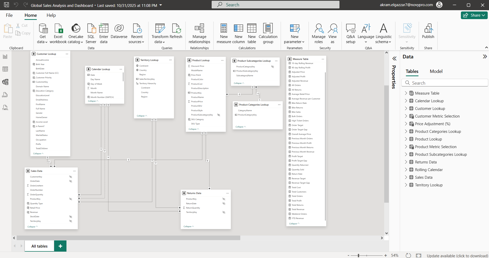
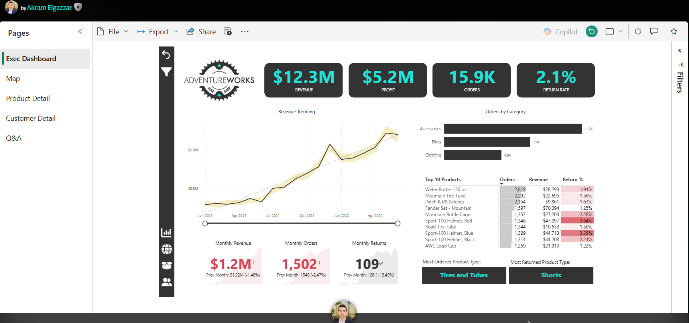
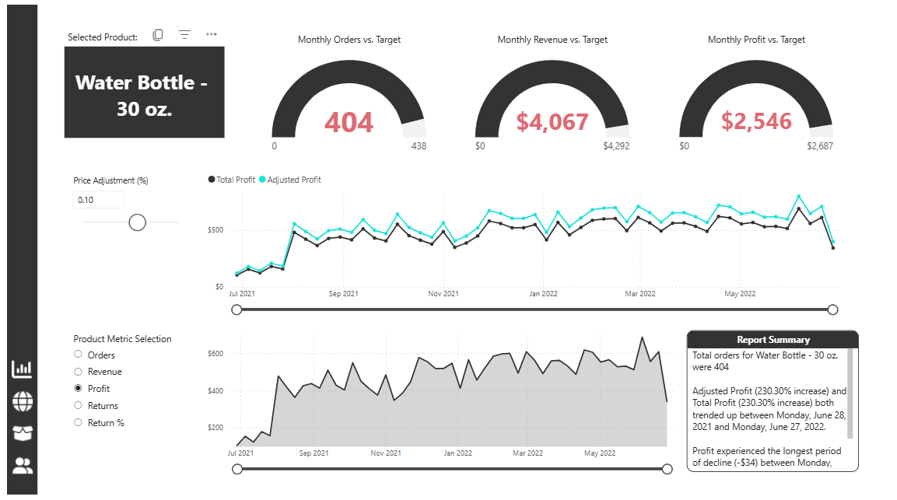
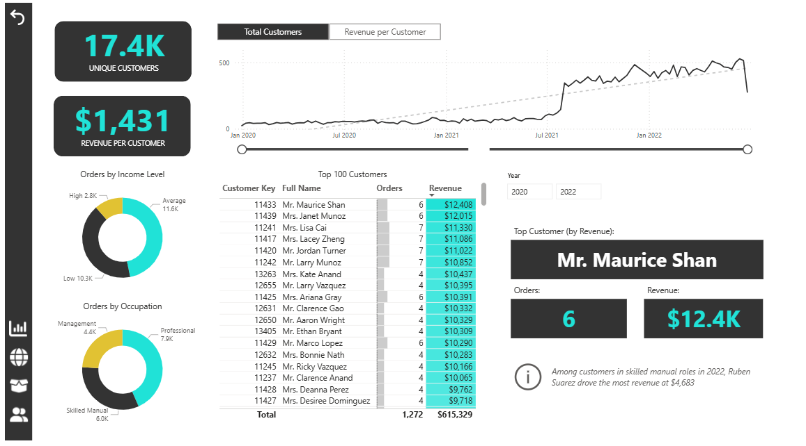
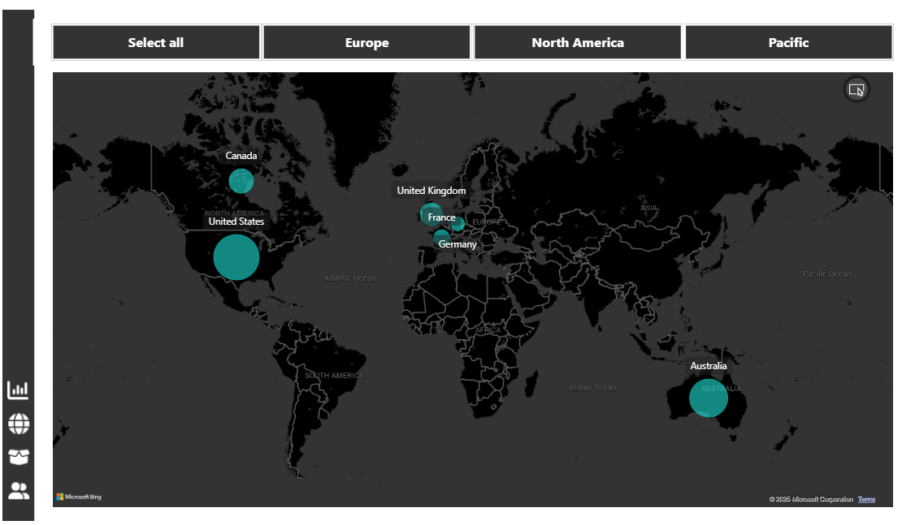

# 🌍 Global Sales Analysis & Dashboard (Power BI)

## 📊 Project Overview
This project presents a **Global Sales Analysis Dashboard** built with **Power BI**, designed to provide deep insights into sales performance across customers, products, territories, and time periods.  
The model follows a **Star Schema** with well-structured relationships between fact and dimension tables, enabling efficient analysis and dynamic reporting.

---

## 🎯 Objective
The main goal of this project is to:
- Analyze **sales trends** across regions, products, and time.
- Identify **top-performing territories, customers, and categories**.
- Monitor **returns** to assess profitability and product quality.
- Enable **data-driven decisions** through interactive dashboards.

---

## 🧱 Data Model Design

The data model was built using a **Star Schema** design for optimal performance and simplicity in analytics.  
It consists of **two fact tables** and **multiple dimension tables** linked through one-to-many relationships.

### 🗂 Fact Tables
- **Sales Data**  
  Contains sales transactions including:
  - CustomerKey  
  - ProductKey  
  - OrderDate  
  - OrderQuantity  
  - Revenue  
  - Net Price  

- **Returns Data**  
  Tracks product returns with:
  - ProductKey  
  - ReturnDate  
  - ReturnQuantity  
  - TerritoryKey  

### 📚 Dimension Tables
- **Calendar Lookup**: Day, Month, Year, Day of Week, Month Number  
- **Customer Lookup**: Customer Name, Birth Year, Gender, Customer Type  
- **Territory Lookup**: Country, Region, Continent  
- **Product Lookup**: Product Name, Model Name, Price, Color  
- **Product Subcategories Lookup**: Subcategory Key, Subcategory Name  
- **Product Categories Lookup**: Category Key, Category Name  

---

## 🔗 Data Model Visualization

Below is the Power BI **Data Model view**, showing relationships between fact and dimension tables:

Each lookup table connects to the **Sales Data** and **Returns Data** tables through keys (e.g., ProductKey, CustomerKey, DateKey).

---

## 📊 Dashboard Pages

### 🧭 1. Executive Dashboard
High-level KPIs and trends showing total revenue, profit, orders, and return rate with top product performance.

---

### 📦 2. Product Detail
Analyze monthly targets vs actuals with adjustable profit simulations and performance summaries.

---

### 👥 3. Customer Detail
Customer segmentation by income, occupation, and key profitability insights.

---

### 🌍 4. Map Dashboard
Interactive global map showing sales performance across **North America, Europe, and the Pacific regions**.

---
## 📈 Project Workflow
1. **Data Import & Cleaning** – Loaded raw AdventureWorks tables into Power Query and performed transformations.  
2. **Data Modeling** – Created relationships and built a star schema model.  
3. **DAX Measures** – Defined calculated metrics for profit, return rate, and targets.  
4. **Dashboard Design** – Developed interactive visuals and performance KPIs.  
5. **Publishing & Sharing** – Published via Power BI Service for global access.

---
## 🏁 Conclusion
This Power BI project provides a full **end-to-end data analysis workflow** — from raw data preparation and modeling to DAX-based analysis and visual storytelling.  

---
